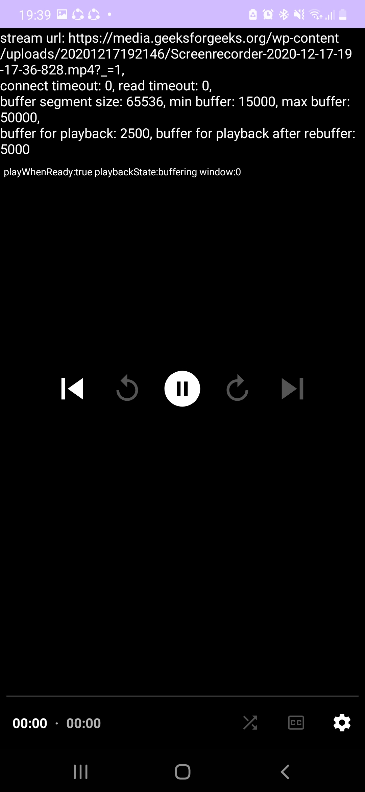
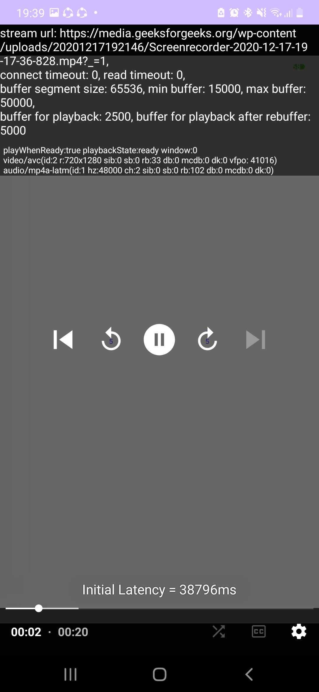
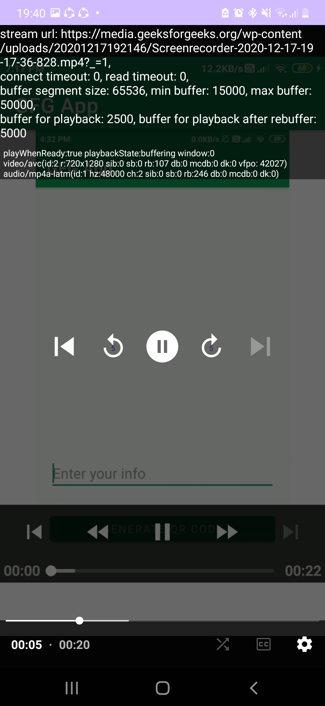
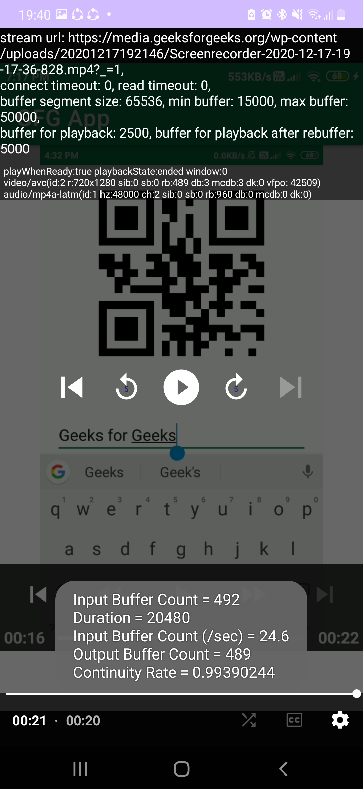
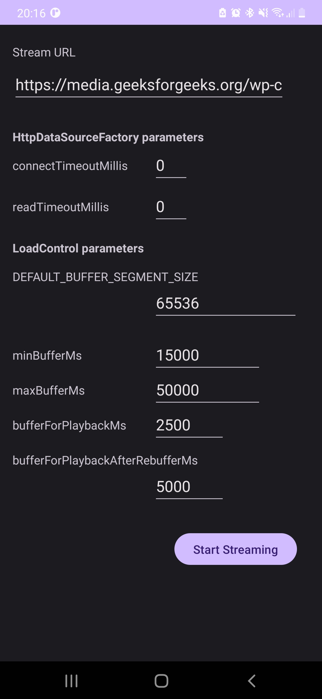

# streaming-media-platform-QoE-kotlin
Contributors: Amirhossein Roudgar, Mohammadali Samadi

## Some Theory First
There are several metrics that can be used to measure the quality of experience (QoE) of video streaming platforms. Here are a few key metrics:

- Buffering ratio: The buffering ratio is the percentage of time that a video experiences buffering or stalling during playback. This can be a significant factor in the QoE, as buffering can interrupt the viewing experience and lead to frustration for users.

- Video quality: Video quality is a key factor in the QoE, and can be measured using metrics such as the peak signal-to-noise ratio (PSNR), structural similarity index (SSIM), or video quality metric (VQM). These metrics assess the quality of the encoded video stream, and can be used to determine whether the video is being delivered in high definition (HD), standard definition (SD), or some other format.

- Start-up time: The start-up time is the amount of time it takes for a video to begin playing after the user initiates playback. Long start-up times can lead to frustration for users and may result in them abandoning the video.

- Playback continuity: Playback continuity refers to the smoothness of the video playback. This metric can be measured using metrics such as the rebuffering ratio, which measures the percentage of the video that needs to be rebuffered during playback.

- Bitrate: The bitrate is the amount of data that is transmitted per unit of time and is a key factor in determining the quality of the video stream. Higher bitrates generally result in better video quality, but can also lead to increased buffering or slower start-up times.

- User engagement: User engagement metrics, such as the amount of time spent watching a video or the number of shares or comments, can also be used to measure the QoE of video streaming platforms. These metrics indicate how well the platform is meeting the needs and preferences of its users.

## What is done in this repo
This project provides the measurement of 3 QoE metrics for video streaming platforms.
The 3 metrics are as follows:
- Initial Latency:
> The amount of latency of a video to begin playing since the first user initiated playback. Obviously, the lower the latency, the happier the users.
- Input Buffer Count per second:
> It will give a rough estimation of the amount of data transmitted for each second of data. This piece of data will have the most meaning when compared with the corresponding values of other streaming sources.
- Continuity Rate:
> The amount of input buffers that were able to be rendered without rebuffering interruptions and without being dropped.

The mentiond parameters can be interpreted as closely related to some of the initially mentioned metrics in the [theoretical](#some-theory-first) section, such as `Buffering ratio`, `Start-up time` and `Playback continuity`.

## Initial Latency Measurement
The moment that a player object (an exoplayer object in this case) is prepared for playback and sets the `playBackState` for the first time to **`STATE_BUFFERING`**, marks the begining of our timer.

The first moment when the `playBackState` is changed from **`STATE_BUFFERING`** to **`STATE_READY`**, will mark the end of our timer. Thus, the difference between the two moments will be the initial latency.

## Input Buffer Count per second
The Total Buffer Counts of each resource is collected at the end of a video stream and is divided by the `duration` of th video. In other words, it's the average `Input Buffer Count` received by the corresponding decoder object assoicated with each player object.

## Continuity Rate
It's the Ratio of total rendered output buffer count to the total input buffer count. Output buffers might be dropped or skipped due to reasons like rebuffering, etc. This parameter can give a rough sense of the quality of the experience of streaming such video.

## How is the data collected?
Each **`SimpleExoPlayer`** object contains a **`videoDecoderCounters`** property of type **`DecoderCounters`** which contains various information about the current video decoder status. Some of its fields consist of:
- inputBufferCount
- renderedOutputBufferCount
- skippedOutputBufferCount
- droppedBufferCount
- maxConsecutiveDroppedBufferCount
- ...

Most of the above fields are discussed when going through the measured parameters in this project. More detail will be given in the documentation.

Below are some screenshots of the application in action. The video being played and streamed is from [this](https://media.geeksforgeeks.org/wp-content/uploads/20201217192146/Screenrecorder-2020-12-17-19-17-36-828.mp4?_=1) link.

<!--  -->
<!--  -->

Initial Buffering to load the video.

<!--  -->

A sample measurement of the initial latency of the video.

A rebuffer occurs in mid-streaming. Pay attention to the next screenshot for the dropped buffers count (db).

We see the continuity rate which is the result of the following division: 489 / 492. The first number as suggested by the screenshot is the total input buffer count and the second number is the total output buffer count. The number of the db (dropped buffers) is 3 which is equal to 492 - 489. The mcdb (max consequtive dropped buffers) can also be of interest here. `mcdb` and `db` values are equal in this example which mean only one incident of rebuffer has happened midplay.

**You can also find a settings page at the start of the program for tweaking with the local buffer configurations. The effect will obviously be same against different sources of media, as we are only changing our own local settings. Namely, this would only affect the performance of the decoding process of the application.**

## More parameters
As seen in the above screenshots, there are some other values extracted from the **`videoDecoderCounters`** property which are as follows:
- rb (rendered buffers)
- db (dropped buffers)
- mcdb (max consequtive dropped buffers)
- vfpo (total video frame processing offset (microseconds))
> The sum of the video frame processing offsets in microseconds.
>
> The processing offset for a video frame is the difference between the time at which the frame became available to render, and the time at which it was scheduled to be rendered. A positive value indicates the frame became available early enough, whereas a negative value indicates that the frame wasn't available until after the time at which it should have been rendered.

